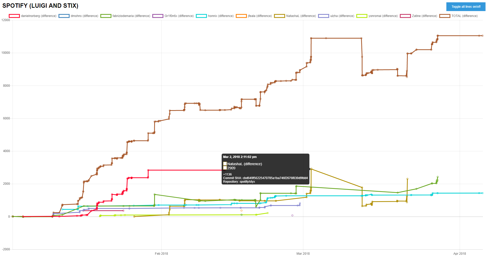

# GREVOS
GREVOS is a simple Python command line tool for generating graphs showing the **combined** activity of any number of GitHub repositories.

GitHub activity graphs are nice, but large projects are often composed of more than one single git repository. GREVOS generates activity graphs for any number of repositories, thus allowing to see the pace of the entire project and who contributes.

## Features
* HTML and CSV outputs.
* Available statistics:
  * Number of commits
  * Additions
  * Deletions
  * Difference (= additions - deletions)
  * Total (= additions + deletions)
* All statistics can be enabled/disabled in the generated output.
* HTML output features:
  * Nice chart showing the progress of your projects.
  * Show total as well as per user contributions.
  * Access commit details on github.com by clicking a point in the graph.
* CSV output features:
  * Specify your preferred date format.
  * Show total as well as per user contributions.
  * Format makes it trivial to generate graph in Excel.
* Possibility to filter by user if you are only interested in the stats for a few users.
* Possibility to keep top contributors only.
* Possibility to map unknown authors to a given username when only email or name is available (but no login name).
* Possibility to limit commits to take into account based on the number of lines added - removed. Convenient to exclude commits that would otherwise bias the statistics (e.g when code formatting is applied or large files are copied into the project).
* Possibility to define `since` date. Convenient when working with very large repositories that contain a large number of commits over the years.
* Works with GitHub API. No need to clone the repositories locally.
* Cache mechanism to not have to fetch data from GitHub every time.
* Works with GitHub Enterprise.

## Prerequisites
* Python 3 (tested with 3.6.5)
* Following libraries must be available (install with pip3 for example):
  * requests
  * jinja2

## Usage
```
patrices-air:grevos patrice$ python3 grevos.py -h
GREVOS
------

usage: grevos.py [-h] [-f FILE] [-a [AUTHORS [AUTHORS ...]]]
                     [-o [OUTPUT_FOLDER]] [-c [CACHE_FOLDER]]
                     [-oc [OUTPUT_COMMITS]] [-oa [OUTPUT_ADDITIONS]]
                     [-od [OUTPUT_DELETIONS]] [-odi [OUTPUT_DIFFERENCES]]
                     [-ot [OUTPUT_TOTALS]] [-d [CSV_DATE_FORMAT]]
                     [-eaf [EMAIL_TO_AUTHOR_FILE]]
                     [-naf [NAME_TO_AUTHOR_FILE]]
                     [-au [ALLOW_UNKWNOWN_AUTHOR]]
                     [-macd [MAX_COMMIT_DIFFERENCE]]
                     [-micd [MIN_COMMIT_DIFFERENCE]] [-tc [TOP_CONTRIBUTORS]]
                     [-mph [MAX_POINTS_HTML]]

Generate combined activity graphs for any number of repositories.

optional arguments:
  -h, --help            show this help message and exit
  -f FILE, --file FILE  File containing the repos to process. Format: <scheme>
                        ,<host>,<base_path>,<org>,<repo>,<branch>,<commit_url_
                        pattern>,<since>,<api_token>[,<commits_to_ignore>].
                        <commits_to_ignore> is a - separated list of SHA
                        commits.
  -a [AUTHORS [AUTHORS ...]], --authors [AUTHORS [AUTHORS ...]]
                        Only outputs statistics for the specified authors (all
                        authors by default).
  -o [OUTPUT_FOLDER], --output_folder [OUTPUT_FOLDER]
                        Folder where the generated CSV files are stored,
                        default: 'output'.
  -c [CACHE_FOLDER], --cache_folder [CACHE_FOLDER]
                        Folder where cache files are stored, default: 'cache'.
  -oc [OUTPUT_COMMITS], --output_commits [OUTPUT_COMMITS]
                        Outputs nb commits in genereted files, default: yes.
  -oa [OUTPUT_ADDITIONS], --output_additions [OUTPUT_ADDITIONS]
                        Outputs additions in genereted files, default: yes.
  -od [OUTPUT_DELETIONS], --output_deletions [OUTPUT_DELETIONS]
                        Outputs deletions in genereted files, default: yes.
  -odi [OUTPUT_DIFFERENCES], --output_differences [OUTPUT_DIFFERENCES]
                        Outputs differences (i.e. additions - deletions) in
                        genereted files, default: yes.
  -ot [OUTPUT_TOTALS], --output_totals [OUTPUT_TOTALS]
                        Outputs totals (i.e. additions + deletions) in
                        genereted files, default: yes.
  -d [CSV_DATE_FORMAT], --csv_date_format [CSV_DATE_FORMAT]
                        Date format in the generated CSV, default: '%m/%d/%Y
                        %H:%M:%S'.
  -eaf [EMAIL_TO_AUTHOR_FILE], --email_to_author_file [EMAIL_TO_AUTHOR_FILE]
                        File providing the mapping between email and username,
                        useful when the username is not available in the Git
                        commit but the email is. File format: one entry per
                        line, first item is the email, second item is the
                        username, separated by a comma.
  -naf [NAME_TO_AUTHOR_FILE], --name_to_author_file [NAME_TO_AUTHOR_FILE]
                        File providing the mapping between name and username,
                        useful when the username is not available in the Git
                        commit but the name is. File format: one entry per
                        line, first item is the name, second item is the
                        username, separated by a comma.
  -au [ALLOW_UNKWNOWN_AUTHOR], --allow_unkwnown_author [ALLOW_UNKWNOWN_AUTHOR]
                        Assigns commits whose author login cannot be retrieved
                        to user '<unknown>' if enabled, makes an error and stops
                        processing otherwise, default: yes.
  -macd [MAX_COMMIT_DIFFERENCE], --max_commit_difference [MAX_COMMIT_DIFFERENCE]
                        Max difference of a commit (i.e. additions -
                        deletions) for it to be considered, default: no limit.
                        This is useful to exclude commits that do not make
                        sense to take into account because many files were
                        copied into the repository (e.g. JavaScript files in
                        node.js projects).
  -micd [MIN_COMMIT_DIFFERENCE], --min_commit_difference [MIN_COMMIT_DIFFERENCE]
                        Min difference of a commit (i.e. additions -
                        deletions) for it to be considered, default: no limit.
                        This is useful to exclude commits that do not make
                        sense to take into account because many files were
                        removed from the repository (e.g. JavaScript files in
                        node.js projects).
  -tc [TOP_CONTRIBUTORS], --top_contributors [TOP_CONTRIBUTORS]
                        Only keep the n top contributors based on the number
                        of (additions - deletions), default: keep all.
  -mph [MAX_POINTS_HTML], --max_points_html [MAX_POINTS_HTML]
                        Maximum number of points in the HTML output. A graph
                        with too many points will not offer a good user
                        experience.
```

## Example

Source file listing the repositories, `spotify_(luigi_and_stix).csv` (`XXXXXXXXXXXXXXXXXXXXX` must be replaced with [your own personal API token](https://blog.github.com/2013-05-16-personal-api-tokens/)):
```
https://,api.github.com,,spotify,luigi,master,https://github.com/{{owner}}/{{repository}}/commit/{{commit_sha}},2018-01-01T00:00:00Z,XXXXXXXXXXXXXXXXXXXXX
https://,api.github.com,,spotify,styx,master,https://github.com/{{owner}}/{{repository}}/commit/{{commit_sha}},2018-01-01T00:00:00Z,XXXXXXXXXXXXXXXXXXXXX
```

Then run with the desired parameters, e.g.:

```
python3 grevos.py \
-oc no -oa no -od no -odi yes -ot no \
-mph 1000 -macd 5000 -micd -5000 -tc 10 \
-f spotify_\(luigi_and_stix\).csv
```

And then wait until all commits have been processed. Note that the first time you generate a graph for a given repository, it might take some time as the data must be retrieved from GitHub. Supsequent executions will be much faster thanks to the necessary data being cached locally.
```
patrices-air:grevos patrice$ python3 grevos.py -oc no -oa no -od no -odi yes -ot no -mph 1000 -macd 5000 -micd -5000 -tc 10 -f spotify_\(luigi_and_stix\).csv
GREVOS
------

Source file: spotify_(luigi_and_stix).csv
Output folder: output
Cache folder: cache
Nb repos to process: 2

Processing: https://api.github.com/repos/spotify/luigi/commits?sha=master&since=2018-01-01T00:00:00Z (repo 1 / 2)
    Cache found (file: cache/0b20038a8d70ef7160c71ad81529d737b5949d60)
    Recovered 37 commits from cache
    Done processing commits (total nb commits processed: 37)
Processing: https://api.github.com/repos/spotify/styx/commits?sha=master&since=2018-01-01T00:00:00Z (repo 2 / 2)
    Cache found (file: cache/f8e706d88f3e8cb3bf278e1823a2fd4a71a26e7c)
    Recovered 371 commits from cache
    Done processing commits (total nb commits processed: 372)
Processing '<unknown>' user data
    Author could not be found (email: ben.sully@dwp.gsi.gov.uk, name: Ben Sully)
        Continuing as user '<unknown>' is allowed
Removing commits to ignore
Calculating top contributors
    Top contributors (in alphabetical order):
        andrewsmartin
        danthelion
        dmohns
        Gr1f0n6x
        himikof
        honnix
        switzer
        Tarrasch
        tmattio
        yonromai
Output file generated: output/spotify_(luigi_and_stix)_20180405152259.csv
Output file generated: output/spotify_(luigi_and_stix)_20180405152259.html
    Total nb authors: 23
    Stats for the following authors are not included:
        <unknown>
        bergman
        danielnorberg
        fabriziodemaria
        jamesmcm
        jfeala
        NatashaL
        nathantsoi
        pkaleta
        riga
        spotify-helios-ci-agent
        ulzha
        Zatine

Done.
```

You can have a look at the generated files in the [docs](docs) folder.
You can even play with the generated HTML <a href="http://patriceferrot.com/grevos/spotify_(luigi_and_stix)_20180405152259.html">here</a> (screenshot below).


